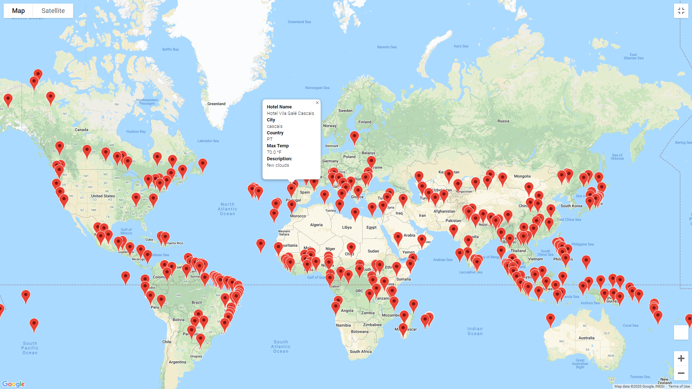
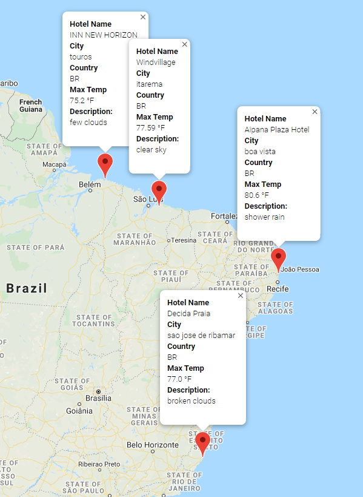

# World_Weather_Analysis

## Overview:
- This project consisted of working with OpenWeatherMaps and Google Maps APIs to generate a vacation list based on desired temperature range, and subsequently plan a trip using visualizations. The overall schema consists of retrieiving the weather data, creating a customer travel destinations map, and creatine a travel itinerary map.

### Deliverable 1:
The purpose of this deliverable was to generate a csv of vacation spots based on a user-input weather range. I used the following modules to complete this task:
```
import requests
import pandas as pd
from citipy import citipy
from config import weather_api_key
import numpy as np
```
I first used numpy's built in random functions to generate a random list of longitude/latitude coordinates. Citipy could then be used to find cities based on these coordinates. From there, I utilized the requests module to obtain city traits including temp., humidity, and cloudiness. Lastly, pandas was used to convert our data into a DataFrame, which could be easily exported to my desired output csv. 

### Deliverable 2:
In this deliverable, I filtered the results of the previously generated dataframe based on a range of user-input weather temperature ranges. The google maps API was then used to create a marker layer map with pop-up hotel markers.




### Deliverable 3:
In the final deliverable, I generated a direction labeled map using the loc function to create individual dataframes, and using waypoints to help create the final map. Upon selecting a starting destination, nearby cities are found by filtering to that country with similar temperatures to ensure distances would not be too far. Lastly, balloon descriptions were mapped to coordinate points to allow us to see an overview of the travel itinerary.


